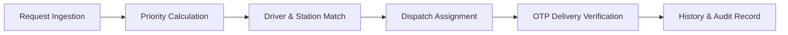

# Municipal Water Supply & Tanker Distribution System

## 1. Scenario Selected
**Selected Scenario:** Municipal water supply / tanker distribution.
* **Reasoning:** Selected because it addresses a complex operational, equity, and trust problem rather than a pure algorithm/routing optimization task (e.g., bus routing). The second-hand market scenario shared similar dynamics, while the diagnostic lab scenario was similar to past domain experience. Choosing water distribution allowed focusing on real-world municipal operational friction.

## 2. Problem Addressed
Municipal water requests during summer shortages currently arrive via unmonitored channels: phone calls, physical letters, office visits, and political referrals. This creates lost or fabricated requests, susceptibility to political manipulation, lack of delivery proof, and opaque prioritization.

The solution does not force an immediate "digitize everything" mandate. Instead, it provides a **traceable municipal request and dispatch workflow** that digitizes backend operations while allowing manual ingestion channels to persist.

**Key Operational Improvements:**
* End-to-end request traceability and delivery accountability (OTP proof of delivery).
* Geographic identification for informal settlements lacking formal street addresses.
* Objective, transparent request prioritization to replace discretionary preference.
* Intelligent driver-location matching and filling-station congestion management.

## 3. Primary Users
1. **Administration / Municipality:** Manages request queues, prioritises orders, assigns tankers/drivers, monitors filling stations, and tracks operational KPIs.
2. **District Manager / Local Representative:** Verifies neighborhood needs, monitors area requests, and submits requests on behalf of residents.
3. **Driver (Municipal & Contracted):** Receives delivery assignments, navigates via landmarks/simple routes, and collects delivery OTPs.
*(Note: Residents are represented as requesters in the data model, but operational workflows target the three roles above).*

## 4. What Is Deliberately Not Solved
To maintain a narrow and functional scope for this submission, the following were intentionally excluded:
* Full replacement of non-digital request channels or a public resident mobile app.
* Production-grade GIS/navigation engines, real-time traffic telemetry, or live SMS/WhatsApp gateways.
* Full offline P2P sync infrastructure, automated multi-stop route optimization, or commercial IAM/RBAC.

> **Prototype vs. Design Distinction:** The system *design* (`Docs/DesignChoice.md`) accounts for offline caching, traffic risk attributes, and station wait times. The *current prototype implementation* provides the core Go/Fiber REST API, PostgreSQL schema, and Next.js management dashboard for the request-to-delivery lifecycle.

## 5. Assumptions
* **Operational Authority:** The municipality holds authority to assign, re-route, and audit both municipal and contracted tankers.
* **Proxy Ingestion:** Staff and local representatives can accurately digitize paper/verbal requests for non-digital residents.
* **Geographic Identification:** Locations can be demarcated via GPS coordinates, landmarks, or map links when formal addresses are missing.
* **Domain Attributes:** Municipal staff can seed structural metadata (e.g., presence of private borewells, institutional priority, baseline traffic risk).

## 6. How the Solution Works End-to-End
1. **Ingestion:** Requests enter digitally or are logged by staff/representatives with geographic coordinates and landmarks.
2. **Priority Scoring:** The system calculates a transparent priority score based on critical institutions (hospitals/schools), pending request duration, borewell availability, and historical water allocation.
3. **Driver & Station Recommendation:** The system recommends drivers with prior delivery experience at the drop-off location and selects filling stations based on current truck congestion.
4. **Dispatch & Delivery:** Administration assigns a vehicle/driver and dispatches the tanker.
5. **Verification:** Upon arrival, the driver inputs an OTP provided by the recipient to verify delivery and record completion.
6. **Historical Audit:** Delivery history updates driver performance records and informs future location prioritization.

## 7. System Architecture & Diagram



```text
Next.js Frontend  <--->  Go + Fiber REST API  <--->  Service / Repository  <--->  PostgreSQL
```

## 8. How to Run

### Requirements
* PostgreSQL database configured with connection string.
* Environment variables set up (copy parameters from `sample.env` or configure `.env`).

### Backend (Go + Fiber)
```bash
# Loads configuration and executes DB migrations automatically on startup
go run ./cmd/server
```

### Frontend (Next.js)
```bash
cd frontend
npm run dev
```

## 9. What Would Be Done With Five Additional Hours
1. **Complete Designed API Endpoints:** Expose full driver history, location rating, and district manager aggregation endpoints.
2. **SMS Gateway Integration:** Implement real SMS delivery for OTP verification (replacing in-app/simulated verification).
3. **WhatsApp Bot Webhook:** Add basic WhatsApp webhook for location sharing and automated status updates.
4. **Offline Sync Queue:** Complete local storage queue and reconciliation logic for driver mobile web views during connectivity drops.
5. **Core Unit Tests:** Add comprehensive unit tests for the priority score algorithm, driver recommendation engine, and state transition safeguards.


## 10. Time Distribution
    - Chosing the problem out of the 4 given scenarios - 1 hour
    - Finding a solution and Noting the problem statement - 30 mins
    - Design Choices + Coding - 3 hours
    - Improving the code and adding more features - 30 mins
